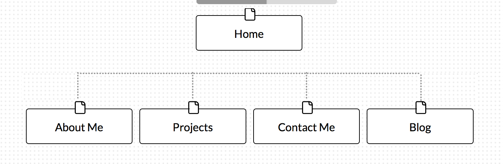

  -What are the 6 Phases of Web Design?
    1. Information Gathering
    2. Planning
    3. Design
    4. Development
    5. Testing and Delivery
    6. Maintenance
  -What is your site's primary goal or purpose?
    To provide visitors information about me.
  -What kind of content will your site feature?
    Information and links about accomplishments and activities.
  -What is your target audience's interests and how do you see your site addressing them?
    My main target audience would be employers.
  -What is the primary "action" the user should take when coming to your site?
    When coming to site users should see general information about me.
  -Do you want them to search for information, contact you, or see your portfolio?
    From the home page users should see link to portfolio.
  -What are the main things someone should know about design and user experience?
    Design and user experience goes hand-in-hand. The desired user experience should dictate the amount of time put into design.
  -What is user experience design and why is it valuable?
    User experience is how a person feels when interfacing with a system.  Simply put, user experience is valuable because bad experience could dictate the return of users to sites.
  -Which parts of the challenge did you find tedious?
    There were no tedious part of this challenge.
