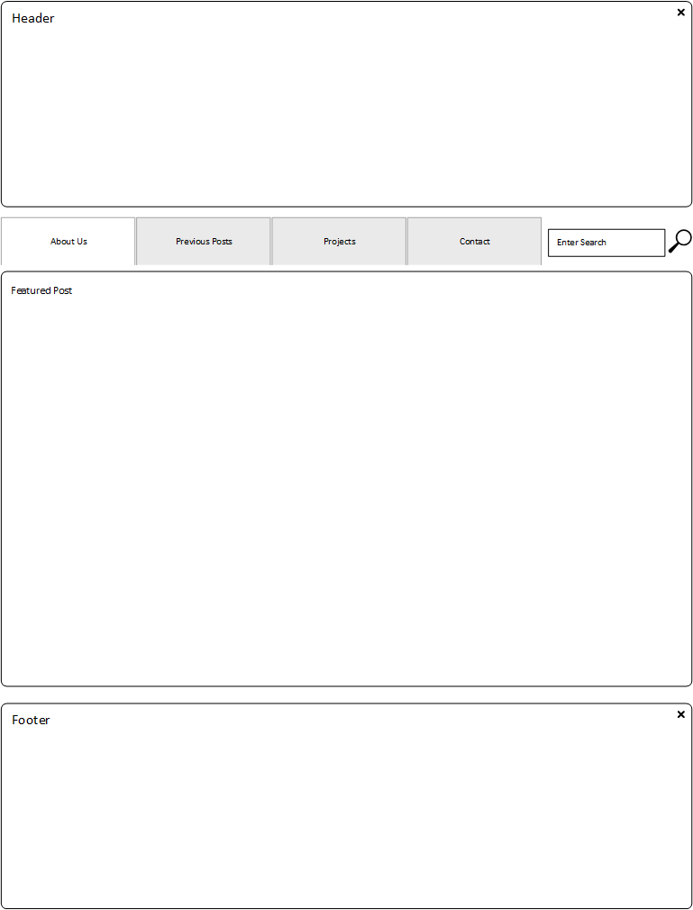

The following image is first wireframe diagram:

The following image is wireframe for blog index page:

    What is a wireframe?
      Wireframe is a basic drawing used to layout a page before coding.
    What are the benefits of wireframing?
      Benefits include being able to conceptualize a web page before coding, layout of components to be included and visualizing user experience to validate flow.
    Did you enjoy wireframing your site?
      No.  Wireframing seems tedious and requires creativity; both traits I do not possess.
    Did you revise your wireframe or stick with your first idea?
      I did not revise my wireframes.  The initial design was what I stuck with, did not want to spend to much time on design features.
    What questions did you ask during this challenge? What resources did you find to help you answer them?
      I didn't ask any questions other than researching available tools for wireframing.  I ended up using Visio to wireframe the sites.
    Which parts of the challenge did you enjoy and which parts did you find tedious?
      I enjoyed creating the .md file and seeing the results from the code written.  The only tedious part of the challenge was working with the tools to create the wireframes.

